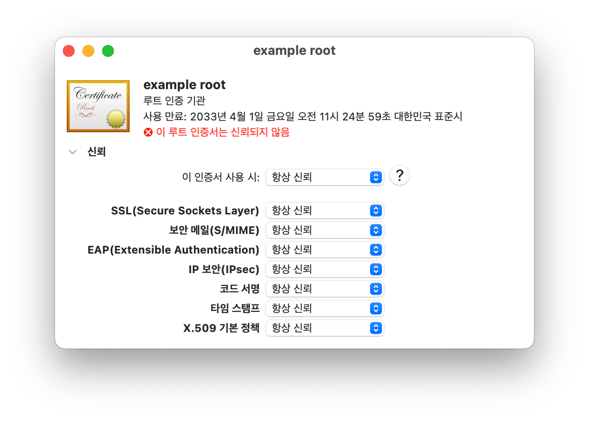

# OpenSSL을 이용한 mTLS

Vault를 사용하지 않고 OpenSSL을 활용하여 mTLS 구현

## 1. Root CA 인증서

### 1.1. Root Key 생성

Root CA 인증서 생성을 위한 Root Key를 생성

[Command]

```bash
cd cert
```

```bash
openssl genrsa -out root.key 2048
```


### 1.2. Root CA 요청서(CSR) 생성

`root.key`를 이용하여 Root CA 인증서 생성을 위한 요청서(CSR)를 생성

[`XXX.conf` 파일 예시]

| 구분                                                 | 작성 예     |
| :--------------------------------------------------- | :---------- |
| Country Name (국가코드)                              | KR          |
| State or Province Name (시/도의 전체이름)            | Seongnam-si |
| Locality Name (시/군/구 등의 이름)                   | Bundang-gu  |
| Organization (회사이름)                              | DDIM        |
| Organization Unit (부서명)                           | Engineer    |
| Common Name (SSL 인증서를 설치할 서버의 Full Domain) | www.xxx.com |

[Command]

```bash
openssl req -config ca.conf -extensions usr_cert -new -key root.key -out ca.csr
```

```bash
openssl req -text -in ca.csr
```

[Output]

```
Certificate Request:
    Data:
        Version: 0 (0x0)
        Subject: C=KR, ST=Seongnam-si, L=Bundang-gu, O=DDIM, OU=Engineer/emailAddress=example@example.com, CN=example root
        Subject Public Key Info:
            Public Key Algorithm: rsaEncryption
                RSA Public-Key: (2048 bit)
                Modulus:
                    <...생략...>
                Exponent: 65537 (0x10001)
        Attributes:
        Requested Extensions:
            X509v3 Basic Constraints:
                CA:TRUE
    Signature Algorithm: sha256WithRSAEncryption
         <...생략...>
-----BEGIN CERTIFICATE REQUEST-----
<...생략...>
-----END CERTIFICATE REQUEST-----
```


### 1.3. Root CA 인증서 생성

생성한 요청서(CSR)에 대해 자체 서명하여 Root CA 인증서를 생성

[Command]

```bash
openssl x509 -req -days 3650 -in ca.csr -extfile ca.ext -signkey root.key -out ca.crt
```

* `-days`: 인증서 기간 10년
* `-extfile`: 서명시 추가 정보에 대한 내용

[Output]

```
Signature ok
subject=/C=KR/ST=Seongnam-si/L=Bundang-gu/O=DDIM/OU=Engineer/emailAddress=example@example.com/CN=example root
Getting Private key
```

[Command]

```bash
openssl x509 -text -noout -in ca.crt
```

[Output]

```
Certificate:
    Data:
        Version: 3 (0x2)
        Serial Number:
            cb:55:08:48:fa:7a:7d:61
    Signature Algorithm: sha256WithRSAEncryption
        Issuer: C=KR, ST=Seongnam-si, L=Bundang-gu, O=DDIM, OU=Engineer/emailAddress=example@example.com, CN=example root
        Validity
            Not Before: Apr  4 02:24:59 2023 GMT
            Not After : Apr  1 02:24:59 2033 GMT
        Subject: C=KR, ST=Seongnam-si, L=Bundang-gu, O=DDIM, OU=Engineer/emailAddress=example@example.com, CN=example root
        Subject Public Key Info:
            Public Key Algorithm: rsaEncryption
                RSA Public-Key: (2048 bit)
                Modulus:
                    <...생략...>
                Exponent: 65537 (0x10001)
        X509v3 extensions:
            X509v3 Basic Constraints:
                CA:TRUE
    Signature Algorithm: sha256WithRSAEncryption
         <...생략...>
```


### 1.4. Root CA 인증서 시스템 등록

[MacOS]

1. `ca.crt` 더블 클릭

2. 키체인 접근

3. 사이드바 `시스템` -> 상단 `인증서` 탭 -> `CN` 값으로 지정한 이름의 인증서 더블클릭

4. `신뢰` 항목 -> `이 인증서 사용 시`를 `항상 신뢰`로 변경




## 2. 서비스 A 용 인증서

### 2.1. 서비스 A 용 Key 생성

서비스 A 용 인증서를 생성하기 위한 Key 생성

[Command]

```bash
openssl genrsa -aes256 -out service-a-with-pw.key 2048
```

```bash
openssl rsa -in service-a-with-pw.key -out service-a.key
```

* 패스워드 4자리 이상 입력 필요


### 2.2. 서비스 A 용 요청서(CSR) 생성

[Command]

```bash
openssl req -config service-a.conf -new -key service-a.key -out service-a.csr
```

```bash
openssl req -text -in service-a.csr
```

[Output]

```
Certificate Request:
    Data:
        Version: 0 (0x0)
        Subject: C=KR, ST=Seongnam-si, L=Bundang-gu, O=DDIM, OU=Engineer/emailAddress=example@example.com, CN=service-a.example.com
        Subject Public Key Info:
            Public Key Algorithm: rsaEncryption
                RSA Public-Key: (2048 bit)
                Modulus:
                    <...생략...>
                Exponent: 65537 (0x10001)
        Attributes:
            a0:00
    Signature Algorithm: sha256WithRSAEncryption
         <...생략...>
-----BEGIN CERTIFICATE REQUEST-----
<...생략...>
-----END CERTIFICATE REQUEST-----
```


### 2.3. 서비스 A 용 인증서 생성

서비스 A 용 인증서가 Root CA에 종속되도록 Root CA 인증서와 Root Key를 넣어 구성

[Command]

```bash
openssl x509 -req -days 365 -in service-a.csr -extfile service-a.ext -CA ca.crt -CAkey root.key -CAcreateserial -out service-a.crt
```

* `-CA`: Root CA 인증서를 지정

* `-CAkey`: Roo Key를 지정
* `-CAcreateserial`: 서명 작업에 Root CA가 서비스 A 용 인증서에 대한 일련번호 생성

```bash
openssl x509 -text -in service-a.crt
```

[Output]

```
Certificate:
    Data:
        Version: 3 (0x2)
        Serial Number:
            ec:71:b0:dd:72:c2:a2:52
    Signature Algorithm: sha256WithRSAEncryption
        Issuer: C=KR, ST=Seongnam-si, L=Bundang-gu, O=DDIM, OU=Engineer/emailAddress=example@example.com, CN=example root
        Validity
            Not Before: Apr  4 08:41:13 2023 GMT
            Not After : Apr  3 08:41:13 2024 GMT
        Subject: C=KR, ST=Seongnam-si, L=Bundang-gu, O=DDIM, OU=Engineer/emailAddress=example@example.com, CN=service-a.example.com
        Subject Public Key Info:
            Public Key Algorithm: rsaEncryption
                RSA Public-Key: (2048 bit)
                Modulus:
                    <...생략...>
                Exponent: 65537 (0x10001)
        X509v3 extensions:
            X509v3 Subject Alternative Name:
                DNS:service-a.example.com
    Signature Algorithm: sha256WithRSAEncryption
         <...생략...>
-----BEGIN CERTIFICATE-----
<...생략...>
-----END CERTIFICATE-----
```


## 3. 서비스 B 용 인증서

### 3.1. 서비스 B 용 Key 생성

서비스 B 용 인증서를 생성하기 위한 Key 생성

[Command]

```bash
openssl genrsa -aes256 -out service-b-with-pw.key 2048
```

```bash
openssl rsa -in service-b-with-pw.key -out service-b.key
```

* 패스워드 4자리 이상 입력 필요


### 3.2. 서비스 B 용 요청서(CSR) 생성

[Command]

```bash
openssl req -config service-b.conf -new -key service-b.key -out service-b.csr
```

```bash
openssl req -text -in service-b.csr
```

[Output]

```
Certificate Request:
    Data:
        Version: 0 (0x0)
        Subject: C=KR, ST=Seongnam-si, L=Bundang-gu, O=DDIM, OU=Engineer/emailAddress=example@example.com, CN=service-b.example.com
        Subject Public Key Info:
            Public Key Algorithm: rsaEncryption
                RSA Public-Key: (2048 bit)
                Modulus:
                    <...생략...>
                Exponent: 65537 (0x10001)
        Attributes:
            a0:00
    Signature Algorithm: sha256WithRSAEncryption
         <...생략...>
-----BEGIN CERTIFICATE REQUEST-----
<...생략...>
-----END CERTIFICATE REQUEST-----
```


### 3.3. 서비스 B 용 인증서 생성

서비스 B 용 인증서가 Root CA에 종속되도록 Root CA 인증서와 Root Key를 넣어 구성

[Command]

```bash
openssl x509 -req -days 365 -in service-b.csr -extfile service-b.ext -CA ca.crt -CAkey root.key -CAcreateserial -out service-b.crt
```

* `-CA`: Root CA 인증서를 지정

* `-CAkey`: Roo Key를 지정
* `-CAcreateserial`: 서명 작업에 Root CA가 서비스 A 용 인증서에 대한 일련번호 생성

```bash
openssl x509 -text -in service-b.crt
```

[Output]

```
Certificate:
    Data:
        Version: 3 (0x2)
        Serial Number:
            ec:71:b0:dd:72:c2:a2:53
    Signature Algorithm: sha256WithRSAEncryption
        Issuer: C=KR, ST=Seongnam-si, L=Bundang-gu, O=DDIM, OU=Engineer/emailAddress=example@example.com, CN=example root
        Validity
            Not Before: Apr  4 08:49:25 2023 GMT
            Not After : Apr  3 08:49:25 2024 GMT
        Subject: C=KR, ST=Seongnam-si, L=Bundang-gu, O=DDIM, OU=Engineer/emailAddress=example@example.com, CN=service-b.example.com
        Subject Public Key Info:
            Public Key Algorithm: rsaEncryption
                RSA Public-Key: (2048 bit)
                Modulus:
                    <...생략...>
                Exponent: 65537 (0x10001)
        X509v3 extensions:
            X509v3 Subject Alternative Name:
                DNS:service-b.example.com
    Signature Algorithm: sha256WithRSAEncryption
         <...생략...>
-----BEGIN CERTIFICATE-----
<...생략...>
-----END CERTIFICATE-----
```


## 4. Demo App을 이용한 Test

> Demo App: https://github.com/Great-Stone/vault-mtls-demo

### 4.1. Preparation

[Command]

```bash
pip install requests flask
```

```bash
sudo vi /etc/hosts
```

[Contents]

```
##
# Host Database
#
# localhost is used to configure the loopback interface
# when the system is booting.  Do not change this entry.
##
127.0.0.1	      localhost service-a.example.com service-b.example.com
255.255.255.255	broadcasthost
::1             localhost
```


### 4.2. Python Demo App 실행

#### 4.2.1. 서비스 A Python Demo App 내용

```python
### 생략 ###
if __name__ == "__main__":
    app.debug = True
    ssl_context = ssl.create_default_context(purpose=ssl.Purpose.CLIENT_AUTH, cafile='../cert/ca.crt')
    ssl_context.load_cert_chain(certfile=f'../cert/{src}.crt', keyfile=f'../cert/{src}.key', password='')
    # ssl_context.verify_mode = ssl.CERT_REQUIRED
    app.run(host="0.0.0.0", port=src_port, ssl_context=ssl_context, use_reloader=True, extra_files=[f'../cert/{src}.crt'])
```

* `ssl.create_default_context`: ssl context를 정의. `cafile`에 Root CA 파일을 지정
* `ssl_context.load_cert_chain`: 인증서 파일과 Key 파일을 지정하여 인증서 체인을 설정
* `ssl_context.verify_mode`: 인증서 검증을 실행하도록 설정. 서비스 A의 경우 인증서 검증을 무시하기 위해 주석 처리


#### 4.2.2. 서비스 B Python Demo App 내용

```python
### 생략 ###
if __name__ == "__main__":
    app.debug = True
    ssl_context = ssl.create_default_context(purpose=ssl.Purpose.CLIENT_AUTH, cafile='../cert/ca.crt')
    ssl_context.load_cert_chain(certfile=f'../cert/{src}.crt', keyfile=f'../cert/{src}.key', password='')
    ssl_context.verify_mode = ssl.CERT_REQUIRED
    app.run(host="0.0.0.0", port=src_port, ssl_context=ssl_context, use_reloader=True, extra_files=[f'../cert/{src}.crt'])
```

* `ssl_context.verify_mode`: 인증서 검증을 실행하도록 설정. 서비스 B의 경우 서비스 A와 다르게 인증서 검증 위해 주석 제거


#### 4.2.3. 서비스 A 실행

[Command]

```bash
cd python_service_a
```

```bash
python main.py
```


#### 4.2.4. 서비스 B 실행

[Command]

```bash
cd python_service_b
```

```bash
python main.py
```


### 4.3. Test API

#### 4.3.1. 서비스 A Check

[Command]

```bash
curl https://service-a.example.com:7443
```

```bash
curl --insecure 
```


[Output]

```
Hello from "service-a"
```

* 서비스 A의 경우 인증서 검증을 무시하기 때문에 정상 메시지 출력


#### 4.3.2. 서비스 B Check

[Command]

```bash
curl https://service-b.example.coom:8443
```

[Output]

```
curl: (56) LibreSSL SSL_read: LibreSSL/3.3.6: error:1404C45C:SSL routines:ST_OK:reason(1116), errno 0
```

* 서비스 B의 경우 인증서 검증을 수행하기 때문에 인증서 요청 에러 출력

[Command]

```bash
curl --cacert ca.crt --key service-b.key --cert service-b.crt https://service-b.example.com:8443
```

* Root CA, 서비스 B 용 Key, 서비스 B 용 인증서를 함께 제공하여 명령어 수행

[Output]

```
Hello From "service-b"
```

* 인증서 검증을 통과하여 정상 메시지 출력


#### 4.3.3. Normal mTLS Check

서비스 A에서 서비스 B로 요청 시, `서비스 A 용 인증서`, `서비스 A 용 Key`, `Root CA 인증서` 모두 설정한 경우

[Demo App Code]

```python
result = requests.get(f'https://{des}.example.com:{des_port}',
         cert=(f'../cert/{src}.crt', f'../cert/{src}.key'),
         verify='../cert/ca.crt')
```

[Command]

```bash
curl https://service-a.example.com:7443/w-mtls
```

[Output]

```
Hello From "service-b"
```


#### 4.3.4. Without Cert

서비스 A에서 서비스 B로 요청 시, `서비스 A 용 인증서`, `서비스 A용 Key`를 설정하지 않는 경우

[Demo App Code]

```python
result = requests.get(f'https://{des}.example.com:{des_port}',
         verify='../cert/ca.crt')
```

[Command]

```bash
curl https://service-a.example.com:7443/wo-cert-mtls
```

[Output]

```
SSLError(SSLEOFError(8, 'EOF occurred in violation of protocol (_ssl.c:2393)'))
```


#### 4.3.5. Without Root CA

서비스 A에서 서비스 B로 요청 시, `Root CA 인증서`를 설정하지 않는 경우

[Demo App Code]

```python
result = requests.get(f'https://{des}.example.com:{des_port}',
         cert=(f'../cert/{src}.crt', f'../cert/{src}.key'))
```

[Command]

```bash
curl https://service-a.example.com:7443/wo-ca-mtls
```

[Output]

```
SSLError(SSLCertVerificationError(1, '[SSL: CERTIFICATE_VERIFY_FAILED] certificate verify failed: self signed certificate in certificate chain (_ssl.c:992)'))
```

* 자체 서명 인증서를 요구하는 에러 메시지 출력